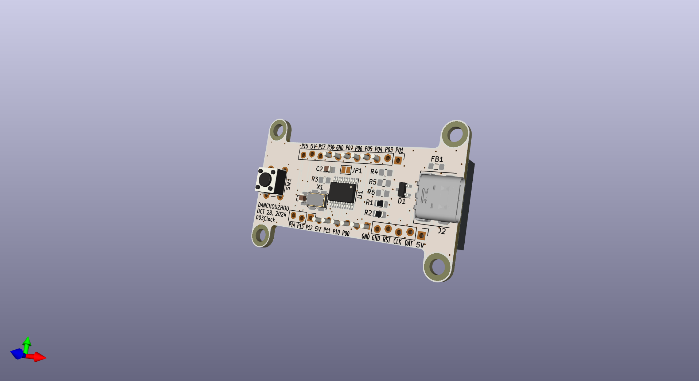
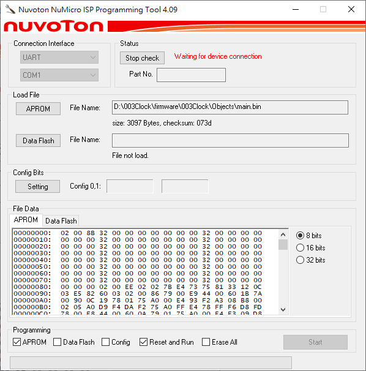

# 003Clock

## Usage
### To clone this project
This project work with submodule from Nuvoton corporation. You need to initialize submodules by passing ``--recurse-submodules`` to the ``git clone`` command.
```
git clone https://github.com/danchouzhou/003Clock.git --recurse-submodules
```

### Build tools
Please make sure the installation path is the same as the one in `setting.json`.
- [SDCC 4.2.0](https://sourceforge.net/projects/sdcc/files/sdcc-win64/4.2.0/)
- [Nu-Link_Command_Tool_V3.17.7691r](https://www.nuvoton.com/tool-and-software/software-tool/programmer-tool/)

### Build the firmware
```
cd firmware/003Clock
```
Simply ``./build.bat``. ``main.bin`` should be inside the ``Objects`` folder.
```
./build.bat
```
### Flash the firmware by Nu-Link programmer (ICP)
```
./flash.bat
```
### Flash the firmware without a Nu-Link programmer (ISP)
1. Download the [NuMicro ISP Programming Tool](https://www.nuvoton.com/tool-and-software/software-tool/programmer-tool/)
2. Connect the target device with USB-UART adapter\

3. Select the COM port and then press `connect`\

4. Power on the target device, ISP Tool should show `connected`